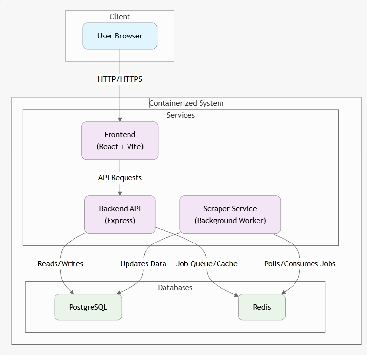

# System Architecture

This document outlines the high-level architecture of the Restaurant Map Discovery system. It's a containerized application composed of a frontend, backend API, background scraper service, and data persistence layers.

## Architecture Diagram

## Component Overview

### 1. Frontend (Client)
- **Technology**: React, Vite
- **Port**: 5173 (External)
- **Role**: Provides the user interface for discovering restaurants on a map and viewing details. It communicates with the Backend API to fetch data.

### 2. Backend API
- **Technology**: Node.js, Express
- **Port**: 3000 (Internal), 90 (External Mapping)
- **Role**: Serves as the central API gateway. It handles client requests, manages scheduling of scraping jobs, and retrieves restaurant data from the database.

### 3. Scraper Service
- **Technology**: Node.js (Background Worker)
- **Role**: dedicated service for scraping Google Maps data. It listens for jobs in the Redis queue (managed by BullMQ or similar), performs the scraping tasks, and updates the database with new restaurant information.

### 4. PostgreSQL (Database)
- **Technology**: Postgres 16
- **Port**: 5432
- **Role**: Primary data store for restaurant information, user data (if any), and job status logs.

### 5. Redis
- **Technology**: Redis Alpine
- **Port**: 6379
- **Role**: Used as a message broker for the job queue (between Backend and Scraper) and potentially for caching frequently accessed data.

## Data Flow

1.  **Job Scheduling**: The Admin/User triggers a scrape job via the Frontend -> Backend.
2.  **Queueing**: The Backend validates the request and adds a job to the Redis queue.
3.  **Processing**: The Scraper Service picks up the job from Redis, scrapes the target area, and processes the data.
4.  **Storage**: Scraped data is saved to PostgreSQL.
5.  **Discovery**: Users view the map on the Frontend, which requests the fresh data from the Backend (reading from PostgreSQL).
